# Manual de usuario

## Objetivos

* Proporcionar instrucciones claras para el registro, inicio de sesión y ajuste de preferencias básicas, así como una explicación de las principales opciones de la interfaz y cómo navegar por ellas.

* Exponer sobre cómo explorar la biblioteca musical, crear y editar listas de reproducción.

* Explicar las medidas de seguridad implementadas para proteger los datos del usuario y ofrecer una aplicación confiable.

## Visión general de la aplicación

La aplicación es una plataforma de streaming de música que permite buscar, escuchar o seleccionar una gran cantidad de canciones, álbumes y listas de reproducción desde cualquier dispositivo con acceso a internet.

* Características principales
    * Listas de reproducción
    * Búsqueda de canciones
    * Modo radio (canciones aleatorias)

* Experiencia del usuario
    * La interfaz de usuario es intuitiva y fácil de navegar, con controles accesibles para reproducir, pausar, adelantar y retroceder canciones. La aplicación permite escuchar música en múltiples dispositivos con sincronización automática, facilitando una experiencia cómoda y coherente sin importar el entorno del usuario o sus preferencias de escucha.

* Seguridad y privacidad
    * La aplicación implementa medidas para garantizar la seguridad y privacidad de los datos personales. Los usuarios tienen control total sobre la visibilidad y el compartimiento de su información, asegurando una gestión segura y personalizada de sus datos.

## Guía de uso de la aplicación

* Acceso a la aplicación web: 

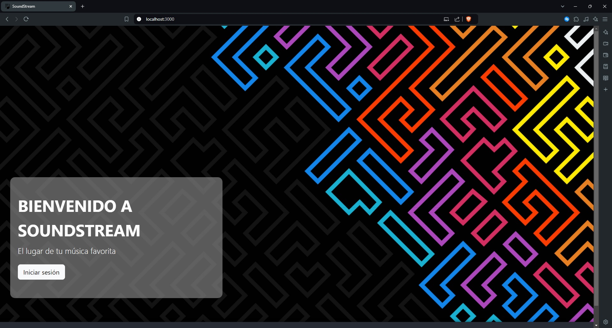

* Navegación básica
    * La navegación en la aplicación es intuitiva, permite a los usuarios moverse por las diferentes secciones con facilidad. La interfaz es limpia y directa, con menús y botones claramente visibles y etiquetados.

* Funciones principales:

    **Vista de Bienvenida**: Es la pantalla inicial que los usuarios ven al acceder a la aplicación. Aquí se presenta un botón que invita al usuario a "Iniciar sesión".

    

    **SoundStream Sesion**

    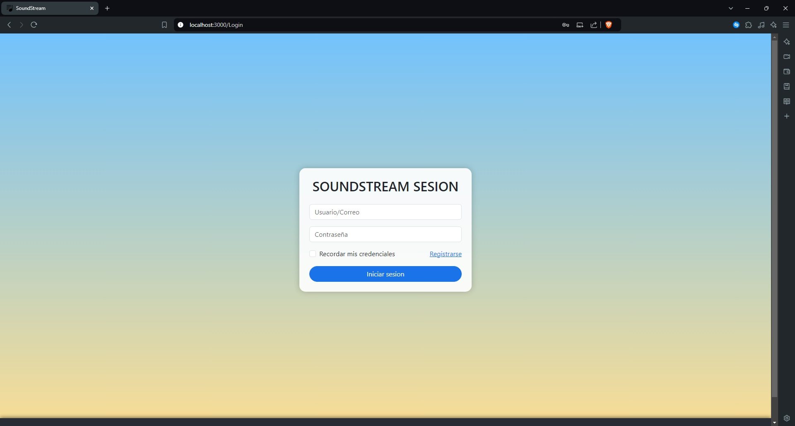

    * **Inicio de sesión y Registro de usuario**: Los usuarios ingresan su email y contraseña, si ya tiene una cuenta, o "registrarse" si es un usuario nuevo.

        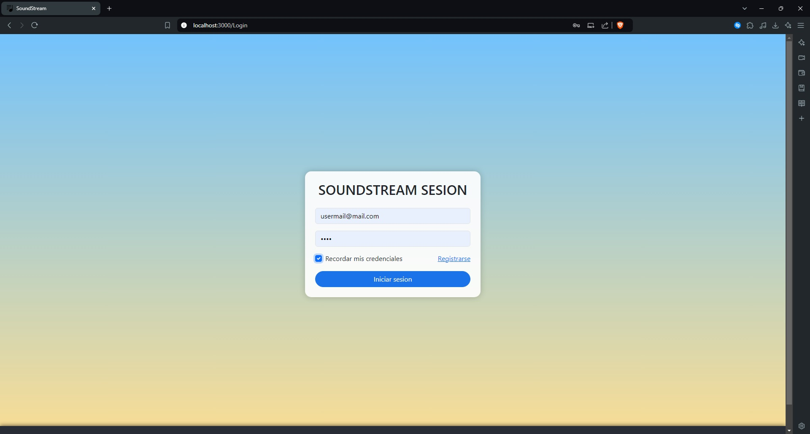
    
    * **Registro de nuevo usuario**: Los nuevos usuarios pueden crear una cuenta ingresando información básica y creando una contraseña. Una vez completado el registro, se redirige al soundstream sesion y se solicita los datos de acceso al usuario.

        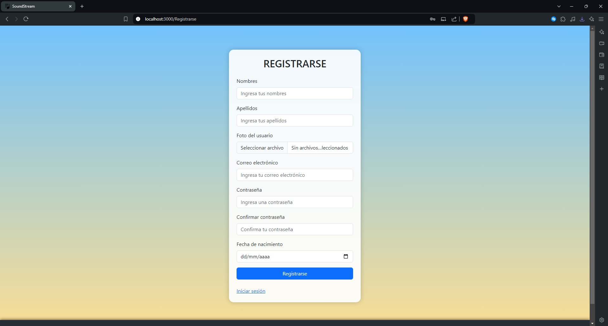

    **Dashboard**: El Dashboard es la página principal de la aplicación, donde se puede acceder a todas las funcionalidades disponibles. Es el centro de control desde el cual pueden realizar búsquedas, crear playlists o administrar su perfil.

    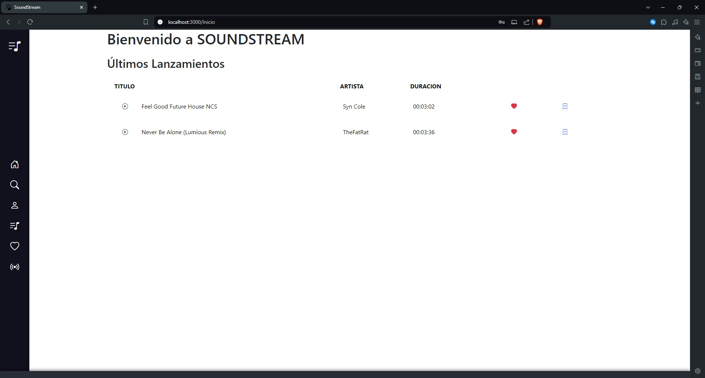

    **Búsqueda de Canción**: Esta opción permite a buscar canciones dentro de la aplicación. El funcionamiento es sencillo se selecciona la opción en el menu desplegable lateral izquierdo en el icono de **lupa**, esta acción permitirá mostrar un cuadro de texto para ingresar el nombre de la canción.

    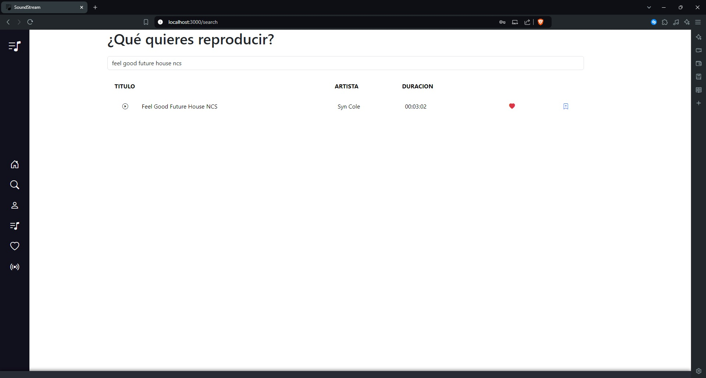

    **Creación de Playlist**: Esta opción permite crear y gestionar listas de reproducción personalizadas.

    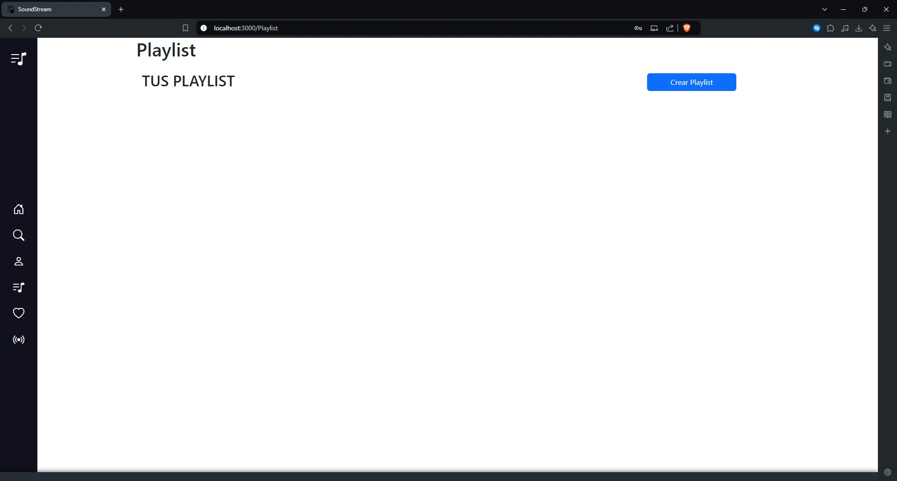

    **Crear una Nueva Playlist**: Desde la opción playlist, se puede seleccionar la opción "Crear Playlist", dar un nombre a la lista, una descripción y una portada.

    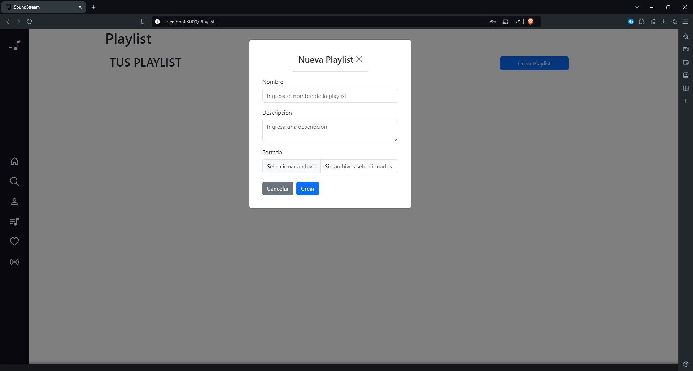

    **Lista de Favoritos**: Esta función permite a marcar canciones favoritas y acceder a ellas rápidamente. Durante la búsqueda o reproducción de canciones, el usuario puede marcar una canción como favorita, posteriormente el usuario puede acceder a su lista de favoritos desde el menu desplegable lateral. Aquí puede reproducir canciones directamente.

    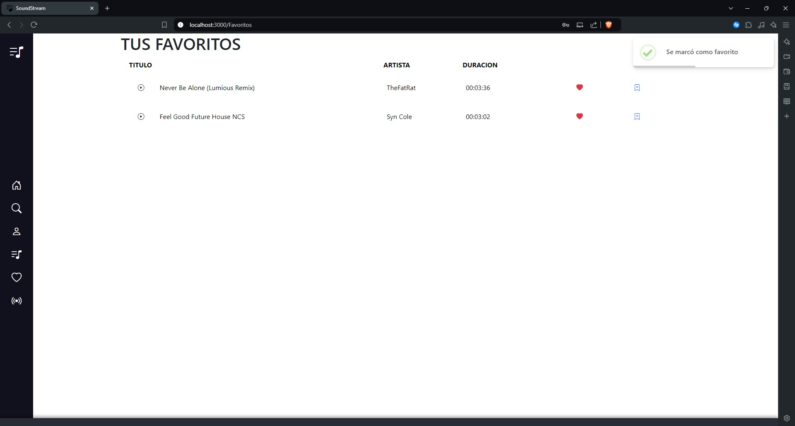

    **Modificación de Datos del Perfil**: Los usuarios tienen la opción de modificar sus datos personales. Desde el menú desplegable, el usuario puede acceder a la sección de perfil, donde se muestran sus datos actuales. 

    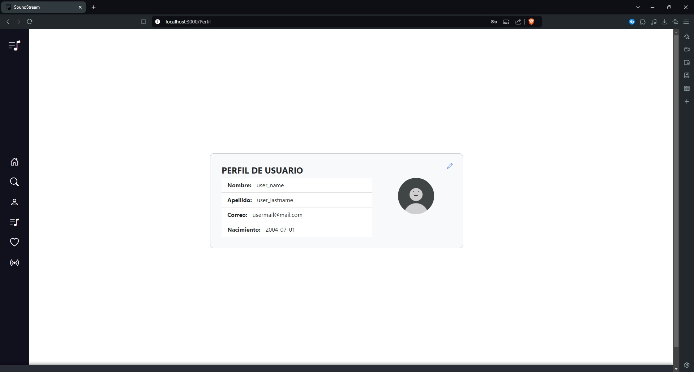

    * El usuario puede modificar su nombre, fecha de nacimiento y otros datos.
    * Para que los cambios sean efectivos debe ingresar su contraseña.

    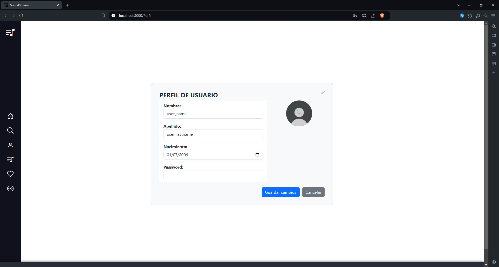

    **Radio SoundStream**: Esta opción permite a los usuarios reproducir canciones aleatoriamente.

    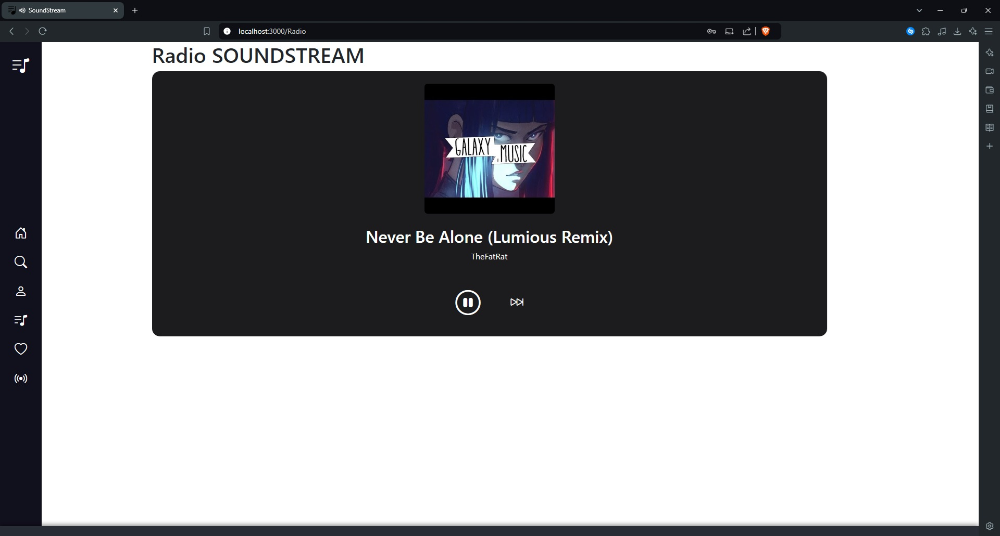